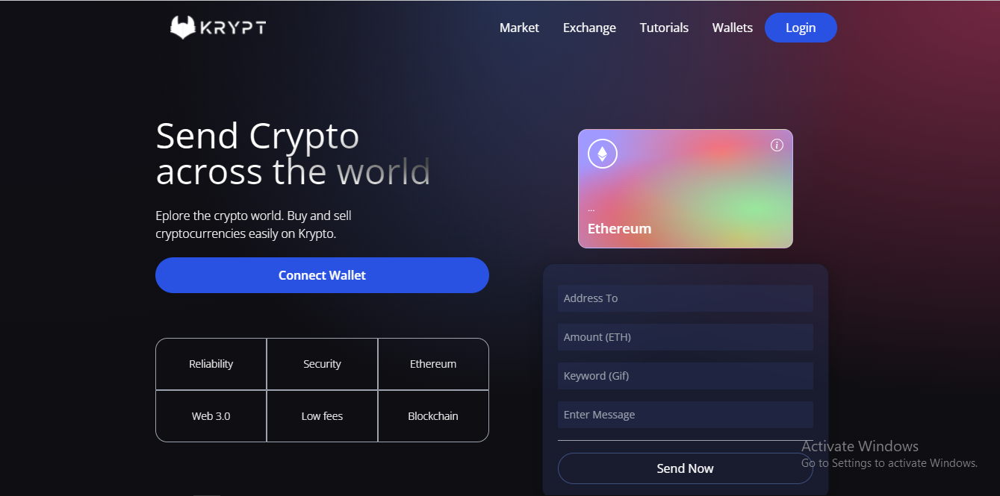

# Krypt
<h4>A tutorial project from Javascriptmastery(.com)</h4>
<h4>A react client front end using an ethereum blockchain as its backend.</h4>
<h4>This is a project i coded by following javascriptmastery(.com).</h4>
<<<<<<< HEAD
<h4>link to site: <a href="https://kind-noyce-5693ab.netlify.app/">Krpyt</a></h4>

=======
link to site: https://kind-noyce-5693ab.netlify.app/
>>>>>>> a5fbf702c9c7a4697b54fc432425238dd6e75bc9
